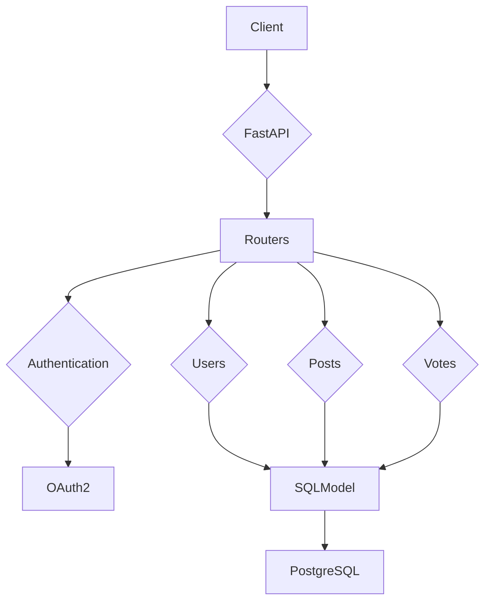

# Social Media API 🐦


[](https://www.python.org/downloads/)
[](https://fastapi.tiangolo.com/)
[](https://sqlmodel.tiangolo.com/)
[](https://www.postgresql.org/)
[](https://opensource.org/licenses/MIT)

## 🚀 Project Overview

This project is a robust and scalable social media backend API, inspired by platforms like Twitter. It is built with a modern Python stack, leveraging FastAPI for high-performance and asynchronous request handling, and SQLModel for type-safe, intuitive database interactions with a PostgreSQL backend. The API provides a comprehensive set of features for user management, post creation, and engagement, all secured with OAuth2 authentication.

## ✨ Key Features

- **User Authentication:** Secure user registration and login using OAuth2 with JWT tokens.
- **CRUD Operations for Users:** Full support for creating, reading, updating, and deleting user profiles.
- **Post Management:** Users can create, view, update, and delete their own posts (referred to as "Mayz" in the codebase).
- **Voting System:** Users can upvote, downvote, or set a neutral vote on posts.
- **Data Validation:** Pydantic-based data validation for robust and error-free data handling.

## 📊 Application Architecture



## 🛠️ Tech Stack

- **Backend:** Python, FastAPI
- **Database:** PostgreSQL
- **ORM:** SQLModel, SQLAlchemy
- **Authentication:** OAuth2, JWT (python-jose), Passlib (bcrypt)
- **Data Validation:** Pydantic
- **Server:** Uvicorn

## 📦 Getting Started

### Prerequisites

- Python 3.8+
- PostgreSQL

### Configuration

The application requires the following environment variables to be set in a `.env` file in the root directory:

| Variable | Description | Example |
| :--- | :--- | :--- |
| `DBMS` | Database management system | `postgresql` |
| `USERNAME` | Database username | `postgres` |
| `PASSWORD` | Database password | `password` |
| `HOSTNAME` | Database host | `localhost` |
| `PORT` | Database port | `5432` |
| `DATABASE` | Database name | `yalemi` |
| `SECRET_KEY` | Secret key for JWT | `your_secret_key` |
| `ALGORITHM` | Algorithm for JWT | `HS256` |
| `EXPIRE_MINUTES` | Token expiration time | `30` |

### Installation

1.  **Clone the repository:**
    ```sh
    git clone https://github.com/your-username/yalemi-api.git
    ```
2.  **Install dependencies:**
    ```sh
    pip install -r requirements.txt
    ```
3.  **Set up environment variables:**
    Create a `.env` file in the root directory and populate it with the required variables (see Configuration above).
4.  **Run the application:**
    ```sh
    uvicorn app.main:app --reload
    ```
5.  **Access the API documentation:**
    Once the server is running, you can access the interactive API documentation at `http://localhost:8000/docs`.

## 🤝 Contributing

Contributions are welcome! Please read `CONTRIBUTING.md` for details on our code of conduct and the process for submitting pull requests.

## 📜 License

This project is licensed under the MIT License. See the `LICENSE` file for details.
