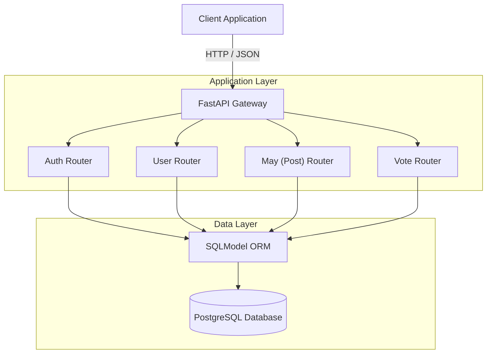

# Yalemi API


> **Y**et **A**nother **L**earning **E**xperience **M**ade **I**n **P**ython.

A robust Social Media REST API built with FastAPI, SQLModel, and PostgreSQL. This project demonstrates a scalable backend architecture featuring user authentication, content management, and interaction systems.


## 🏗️ Architecture



## 🚀 Features

- **User Management**: Registration, profile updates, and secure password handling.
- **Authentication**: JWT-based OAuth2 authentication flow.
- **Content System**: Create, read, and manage "Mays" (posts).
- **Voting System**: Upvote/downvote functionality with duplicate prevention.
- **Documentation**: Auto-generated Swagger UI and ReDoc.

## 🛠️ Installation

1. **Clone the repository**
   ```bash
   git clone https://github.com/adcondev/yalemi-api.git
   cd yalemi-api
   ```

2. **Create a virtual environment**
   ```bash
   python -m venv venv
   source venv/bin/activate  # On Windows: venv\Scripts\activate
   ```

3. **Install dependencies**
   ```bash
   pip install -r requirements.txt
   ```

4. **Environment Configuration**
   Copy `.env.example` to `.env` and update the values:
   ```bash
   cp .env.example .env
   ```
   *Make sure you have a PostgreSQL instance running and accessible.*

## 🏃 Usage

Start the development server:

```bash
uvicorn app.main:app --reload
```

The API will be available at `http://localhost:8000`.
- **Interactive Docs (Swagger UI):** `http://localhost:8000/docs`
- **Alternative Docs (ReDoc):** `http://localhost:8000/redoc`

## 🤝 Contributing

Please read [CONTRIBUTING.md](CONTRIBUTING.MD) for details on our code of conduct, and the process for submitting pull requests to us.

## 📄 License

This project is licensed under the MIT License - see the [LICENSE](LICENSE) file for details.
